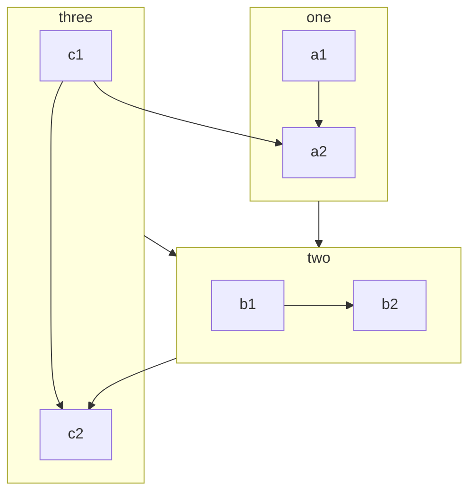

Mỗi trang tài liệu trong VuePress được kết xuất bởi Markdown. 

Bạn cần xây dựng tài liệu hoặc trang blog của mình bằng cách tạo và viết Markdown trong đường dẫn tương ứng. 

<! - Thêm ->

## Markdown introduction

Nếu bạn là một người mới và không biết cách viết Markdown, vui lòng đọc [giới thiệu Markdown](https://vuepress-theme-hope.github.io/v2/basic/markdown/README.html) và [mẫu Markdown](https://vuepress-theme-hope.github.io/v2/basic/markdown/demo.html).

::: về Định dạng Bìa (Frontmatter)

Định dạng Bìa (Frontmatter) là một khái niệm quan trọng trong VuePress. Nếu bạn không biết, bạn cần đọc [Giới thiệu Định dạng Bìa (Frontmatter)](https://vuepress-theme-hope.github.io/v2/basic/vuepress/page.html#front-matter).

:::

## Làm phong phú VuePress.

Để nâng cao quá trình viết tài liệu, VuePress đã mở rộng cú pháp Markdown. 

Đối với các tiện ích mở rộng này, vui lòng đọc [Mở rộng Markdown trong VueSpress](https://vuepress-theme-hope.github.io/v2/basic/vuepress/markdown.html).

## Làm phong phú Chủ đề.

### Enable all

Bạn có thể thiết lập `themeconfig.plugins.htmlenhance.enableAll` để bật tất cả các tính năng của plugin [md-enhance] (https://vuepress-theme-hope.github.io/v2/md-enhance/).

```js {3-5}
module.exports = {
  themeConfig: {
    plugins: {
      mdEnhance: {
        enableAll: true,
      },
    },
  },
};
```

## Tính năng mới 

### Mục chứa (Container) tùy chỉnh

::: v-pre

Dùng các {{ biến }} một cách an toàn trong Markdown.

:::

::: thông tin về Đề mục tùy chỉnh

Một mục chưa chứa thông tin tùy chỉnh với `code`, [link](#markdown).

```js
const a = 1;
```

:::

::: mục "mẹo" tùy chỉnh

Một mục chứa "mẹo" tùy chỉnh

:::

::: mục cảnh báo tùy chỉnh

Một mục chứa cảnh báo tùy chỉnh

:::

::: mục nguy hiểm tùy chỉnh

Một mục chứa phần "nguy hiểm" tùy chỉnh

:::

::: mục chi tiết tùy chỉnh

Một mục chứa chi tiết tùy chỉnh

:::

:::: Code của phần nội dung:

```md
::: v-pre

Dùng các {{ biến }} một cách an toàn trong Markdown.

:::

::: thông tin về Đề mục tùy chỉnh

Một mục chưa chứa thông tin tùy chỉnh với `code`, [link](#markdown).

```js
const a = 1;
```

:::

::: mục "mẹo" tùy chỉnh

Một mục chứa "mẹo" tùy chỉnh

:::

::: mục cảnh báo tùy chỉnh

Một mục chứa cảnh báo tùy chỉnh

:::

::: mục nguy hiểm tùy chỉnh

Một mục chứa phần "nguy hiểm" tùy chỉnh

:::

::: mục chi tiết tùy chỉnh

Một mục chứa chi tiết tùy chỉnh

:::
```

::::

### CodeGroup

:::: code-group

::: code-group-item yarn

```bash
yarn add -D vuepress-theme-hope
```

:::

::: code-group-item npm:active

```bash
npm i -D vuepress-theme-hope
```

:::

::::

- [Chi tiết](https://vuepress-theme-hope.github.io/v2/guide/markdown/code-group.html)

### Chỉ số trên/dưới

19^th^ H~2~O

- [Chi tiết](https://vuepress-theme-hope.github.io/v2/guide/markdown/sup-sub.html)

### Căn chỉnh

::: giữa

Tôi ở giữa

:::

::: phải

Tôi ở bên phải

:::

- [Chi tiết](https://vuepress-theme-hope.github.io/v2/guide/markdown/align.html)

### Ghi chú phụ(Footnote)

Dòng này có ghi chú phụ[^first].

[^first]: Đây là ghi chú phụ

- [Chi tiết](https://vuepress-theme-hope.github.io/v2/guide/markdown/footnote.html)

### Đánh dấu

Bạn có thể đánh dấu ==từ quan trọng== .

- [Chi tiết](https://vuepress-theme-hope.github.io/v2/guide/markdown/mark.html)

### Danh sach công việc

- [x] Plan A
- [ ] Plan B

- [Chi tiết](https://vuepress-theme-hope.github.io/v2/guide/markdown/tasklist.html)

### Biểu đồ

::: biểu đồ Scatter

```json
{
  "type": "scatter",
  "data": {
    "datasets": [
      {
        "label": "Scatter Dataset",
        "data": [
          { "x": -10, "y": 0 },
          { "x": 0, "y": 10 },
          { "x": 10, "y": 5 },
          { "x": 0.5, "y": 5.5 }
        ],
        "backgroundColor": "rgb(255, 99, 132)"
      }
    ]
  },
  "options": {
    "scales": {
      "x": {
        "type": "linear",
        "position": "bottom"
      }
    }
  }
}
```

:::

- [Chi tiết](<[chart.md](https://vuepress-theme-hope.github.io/v2/guide/markdown/chart.html)>)

### Sơ đồ khối

```flow
cond=>condition: Process?
process=>operation: Process
e=>end: End

cond(yes)->process->e
cond(no)->e
```

- [Chi tiết](https://vuepress-theme-hope.github.io/v2/guide/markdown/flowchart.html)

### Mermaid



- [Chi tiết](https://vuepress-theme-hope.github.io/v2/guide/markdown/mermaid.html)

### Tex

$$
\frac {\partial^r} {\partial \omega^r} \left(\frac {y^{\omega}} {\omega}\right)
= \left(\frac {y^{\omega}} {\omega}\right) \left\{(\log y)^r + \sum_{i=1}^r \frac {(-1)^i r \cdots (r-i+1) (\log y)^{r-i}} {\omega^i} \right\}
$$

- [Chi tiết](https://vuepress-theme-hope.github.io/v2/guide/markdown/tex.html)

### Code mẫu

::: 1 cái mẫu rất bình thường

```html
<h1>VuePress Theme Hope</h1>
<p>Is <span id="very">very</span> powerful!</p>
```

```js
document.querySelector("#very").addEventListener("click", () => {
  alert("Very powerful!");
});
```

```css
span {
  color: red;
}
```

:::

- [Chi tiết](https://vuepress-theme-hope.github.io/v2/guide/markdown/demo.html)

### Bản trình chiếu

@slidestart

## Slide 1

Một đoạn văn với một vài dòng và một [link](https://mrhope.site)

---

## Slide 2

- Item 1
- Item 2

---

## Slide 3.1

```js
const a = 1;
```

--

## Slide 3.2

$$
J(\theta_0,\theta_1) = \sum_{i=0}
$$

@slideend

- [Chi tiết](https://vuepress-theme-hope.github.io/v2/guide/markdown/presentation.html)
